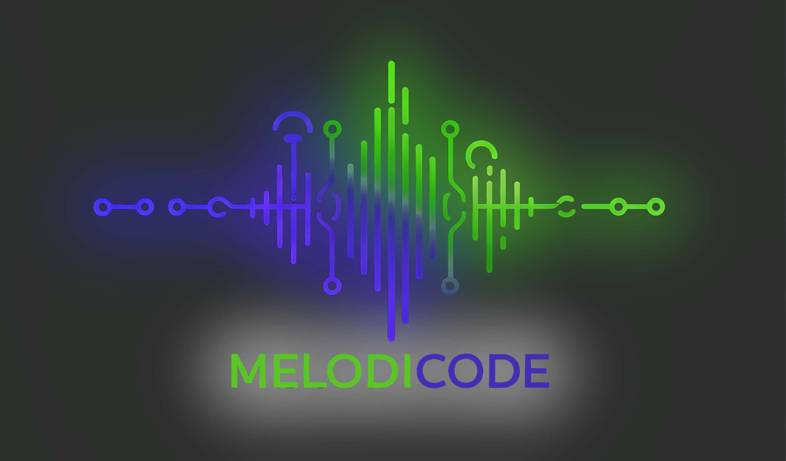

<p align="center">
  
</p>
# MelodiCode - Code-Based Music Generator

A powerful web-based Digital Audio Workstation (DAW) that lets you create music using a custom block-based programming language. Compose, arrange, and produce music through code with real-time audio processing, AI assistance, and professional-grade effects.

Use the built-in Google Gemini assistant(with your own API key) to generate songs, samples or even explain your code

## 🎵 Features

### Core Music Production
- **Block-based Code Syntax**: Intuitive programming language for music creation
- **Real-time Audio Processing**: Web Audio API powered engine with low-latency playback
- **Built-in Sample Library**: High-quality drum samples, bass sounds, leads, and pads
- **Audio File Import**: Support for WAV, MP3, OGG, FLAC, and other audio formats
- **Professional Effects**: Compressor, limiter, reverb, and 3-band EQ
- **WAV Export**: Render your compositions to high-quality audio files

### Development Environment
- **Modern UI**: Beautiful, responsive interface with multiple theme options
- **Live Code Editor**: Syntax highlighting and real-time validation
- **Project Management**: Save, load, and organize your music projects
- **Auto-save**: Never lose your work with automatic project backup
- **Block Inspector**: Real-time analysis of your code structure and content

### AI Integration
- **Google Gemini AI**: Intelligent music composition assistant
- **Code Generation**: AI-powered melody, rhythm, and arrangement creation
- **Musical Guidance**: Expert advice on music theory and composition techniques
- **Smart Suggestions**: Context-aware improvements for your compositions

### Advanced Features
- **Multi-track Playback**: Play multiple blocks simultaneously with individual volume and pan
- **Effect Chains**: Apply effects to individual blocks or the master output
- **Waveform Visualization**: Real-time audio analysis and visual feedback
- **Keyboard Shortcuts**: Efficient workflow with customizable hotkeys
- **Responsive Design**: Works seamlessly on desktop and mobile devices

## 🚀 Getting Started

### Quick Start
1. Open `index.html` in a modern web browser
2. The application will initialize automatically
3. Try the example code or create your own compositions
4. Use the transport controls to play, pause, and stop playback

### Basic Syntax

```melodicode
// Define a drum pattern
[drums]
sample kick 1 1 0.8     // kick drum at normal pitch and volume
wait 0.5                // wait half a second
sample snare 1 1 0.7    // snare drum
wait 0.5
[end]

// Define a bass line
[bass]
tone C2 0.5 0.8         // C2 note for 0.5 seconds
wait 0.5
tone G2 0.5 0.8         // G2 note
wait 0.5
[end]

// Play blocks together
play drums bass
```

## 📖 Language Reference

### Block Definition
```melodicode
[block_name]
    // Commands go here
[end]
```

### Commands

#### Sample Playback
```melodicode
sample <name> [pitch] [timescale] [volume] [pan]
```
- `name`: Sample name (kick, snare, hihat, etc.)
- `pitch`: Playback speed multiplier (default: 1)
- `timescale`: Time stretch factor (default: 1)
- `volume`: Volume level 0-1 (default: 0.8)
- `pan`: Stereo position -1 to 1 (default: 0)

#### Tone Generation
```melodicode
tone <frequency|note> [duration] [volume] [pan] [waveType]
```
- `frequency|note`: Frequency in Hz or note name (C4, A#3, etc.)
- `duration`: Length in seconds (default: 1)
- `volume`: Volume level 0-1 (default: 0.8)
- `pan`: Stereo position -1 to 1 (default: 0)
- `waveType`: sine, square, sawtooth, triangle (default: sine)

#### Timing
```melodicode
wait <duration>
```
- `duration`: Time to wait in seconds

#### Block Playback
```melodicode
play <block1> [block2...] [parameters...]
```
- Play one or more blocks simultaneously
- Parameters: `volume=0.8`, `pan=0`, etc.

#### Loops
```melodicode
loop <count> <block_name>
```
- Repeat a block specified number of times

#### Variables
```melodicode
set <variable> <value>
```
- Set a variable for reuse in commands

### Built-in Samples

**Drums:**  
kick, snare, hihat, hihat_open, crash, ride, tom_high, tom_mid, tom_low, clap, triangle

**Percussion:**  
shaker, tambourine, cowbell, woodblock

**Bass:**  
bass_low, bass_mid, bass_high, sub_bass, bass_pluck

**Synth Leads:**  
lead_1, lead_2, lead_bright, lead_soft

**Pads:**  
pad_1, pad_warm, pad_strings, pad_choir

**FX:**  
whoosh, zap, drop, rise

## 🎨 Themes

MelodiCode supports multiple visual themes:
- **Dark**: Default professional dark theme
- **Light**: Clean bright theme for daylight use
- **Neon**: Cyberpunk-inspired theme with glow effects
- **Retro**: Vintage computer terminal aesthetic

Customize colors and create your own themes using CSS variables.

## 🤖 AI Assistant

### Setup
1. Get a Google Gemini API key from [Google AI Studio](https://makersuite.google.com/app/apikey)
2. Open Settings → Gemini AI tab
3. Enter your API key and save

### Usage
- Ask for musical inspiration: "Create a catchy pop song"
- Get technical help: "How do I make a drum pattern?"
- Improve existing code: "Make this bassline more interesting"
- Learn music theory: "Explain chord progressions"

## 🔧 Technical Details

### System Requirements
- Modern web browser with Web Audio API support
- Minimum 4GB RAM recommended
- Chrome, Firefox, Safari, or Edge (latest versions)

### Browser Compatibility
- ✅ Chrome 66+
- ✅ Firefox 60+
- ✅ Safari 14+
- ✅ Edge 79+

### Audio Specifications
- Sample Rate: 44.1kHz, 48kHz, or 96kHz
- Bit Depth: 32-bit float (internal processing)
- Latency: <10ms (hardware dependent)
- Export Format: 16-bit WAV

## 📁 Project Structure

```
MelodiCode/
├── index.html              # Main application file
├── css/
│   ├── styles.css          # Core styles and layout
│   └── themes.css          # Theme definitions
├── js/
│   ├── app.js              # Main application controller
│   ├── audio-engine.js     # Web Audio API integration
│   ├── code-interpreter.js # MelodiCode language parser
│   ├── ui-manager.js       # User interface management
│   ├── file-manager.js     # Project and file handling
│   └── gemini-integration.js # AI assistant integration
└── README.md               # This file
```

## 🎯 Examples

### Drum Pattern
```melodicode
[basic_beat]
    sample kick 1 1
    wait 0.5
    sample snare 1 1
    wait 0.5
    sample kick 1 1
    wait 0.25
    sample kick 1 1
    wait 0.25
    sample snare 1 1
    wait 0.5
[end]

loop 4 basic_beat
```

### Melody with Harmony
```melodicode
[melody]
    tone C4 0.5
    tone E4 0.5
    tone G4 0.5
    tone C5 0.5
[end]

[harmony]
    tone C3 2.0
[end]

play melody harmony volume=0.8
```

### Electronic Beat
```melodicode
[kick_pattern]
    sample kick 1 1 0.9
    wait 0.5
    sample kick 1 1 0.6
    wait 0.5
[end]

[hihat_pattern]
    wait 0.25
    sample hihat 1 1 0.4
    wait 0.25
    sample hihat 1 1 0.4
    wait 0.25
    sample hihat 1 1 0.4
    wait 0.25
[end]

[bass_drop]
    tone C1 0.1 1.0 0 square
    tone C1 0.1 1.0 0 square
    tone C1 0.3 1.0 0 square
    wait 0.5
[end]

play kick_pattern hihat_pattern bass_drop
```

## 🛠️ Development

### Local Development
1. Clone or download the repository
2. Open `index.html` in a web browser
3. No build process required - pure HTML/CSS/JavaScript

### Adding Custom Samples
1. Use the Import Audio button in the left panel
2. Supported formats: WAV, MP3, OGG, FLAC, AAC
3. Samples are automatically available in your code

### Contributing
- Report bugs and request features via GitHub issues
- Submit pull requests for improvements
- Follow existing code style and conventions

---

## 🧩 Adding New Built-in Samples

MelodiCode supports expanding its built-in sample library. Here’s how to add new samples and ensure they are available in the UI and Gemini AI assistant:

### 1. **Add the Sample to the Audio Engine**

- Open [`js/audio-engine.js`](js/audio-engine.js).
- In the `AudioEngine` class, locate the `loadBuiltInSamples()` method.
- Add your new sample to the `builtInSamples` object, either by generating it programmatically or loading it from a file.

```js
// js/audio-engine.js [loadBuiltInSamples()]
// ...existing code...
'bongo': await this.generateBongo(), // Example: Add a new bongo sample
// ...existing code...
```

- Implement the sample generation method if needed (e.g., `generateBongo()`).

### 2. **Update the UI to Display the Sample**

- Open [`js/ui-manager.js`](js/ui-manager.js).
- In the `populateBuiltInSamplesPanel()` method, add your sample to the appropriate category in the `categories` object.

```js
// js/ui-manager.js [populateBuiltInSamplesPanel()]
// ...existing code...
Percussion: ['shaker', 'tambourine', 'cowbell', 'woodblock', 'bongo'],
// ...existing code...
```

- The UI will now show your new sample in the built-in samples panel.

### 3. **Make the Sample Available to Gemini**

- Open [`js/gemini-integration.js`](js/gemini-integration.js).
- In the `getAvailableSamples()` method, add your new sample to the `builtInSamples` array.

```js
// js/gemini-integration.js [getAvailableSamples()]
// ...existing code...
const builtInSamples = [
    'kick', 'snare', 'hihat', /* ... */, 'bongo'
];
// ...existing code...
```

- This ensures Gemini is aware of the new sample and can suggest it in generated code.

### 4. **(Optional) Update the Language Reference**

- Add your new sample to the "Built-in Samples" section of this README for documentation.

```markdown
### Built-in Samples

**Drums:**  
kick, snare, hihat, hihat_open, crash, ride, tom_high, tom_mid, tom_low, clap, triangle

**Percussion:**  
shaker, tambourine, cowbell, woodblock

**Bass:**  
bass_low, bass_mid, bass_high, sub_bass, bass_pluck

**Synth Leads:**  
lead_1, lead_2, lead_bright, lead_soft

**Pads:**  
pad_1, pad_warm, pad_strings, pad_choir

**FX:**  
whoosh, zap, drop, rise
```

### 5. **Test Your Sample**

- Reload the app in your browser.
- Confirm the sample appears in the UI and can be played.
- Ask Gemini to generate code using your new sample (e.g., "Create a drum pattern with bongo").

---

## 🧑‍🏫 Tutorial: Adding a New Built-in Sample

**Example: Add a "bongo" sample**

1. **Audio Engine**:  
   - Implement `generateBongo()` in `audio-engine.js` or load a bongo sample.
   - Add `'bongo': await this.generateBongo()` to the `builtInSamples` object.

2. **UI Manager**:  
   - Add `'bongo'` to the `Percussion` array in `populateBuiltInSamplesPanel()`.

3. **Gemini Integration**:  
   - Add `'bongo'` to the `builtInSamples` array in `getAvailableSamples()`.

4. **Documentation**:  
   - Update the README’s built-in samples list.

5. **Test**:  
   - Reload and verify the sample is available and Gemini can use it.

---

**Tip:**  
Whenever you add or rename a built-in sample, update all three places:  
- `audio-engine.js` (for sound generation/loading)  
- `ui-manager.js` (for UI display)  
- `gemini-integration.js` (for AI awareness)

---

## If you want to use a prompt to generate code in your favorite AI, use this:
```
You are a MelodiCode music programming assistant.

SYNTAX(Remember the order of the parameters, DO NOT MIX THEM UP):
- Blocks: [name] commands [end]
- Commands: set <variable> <value>,
    *sample <name> [pitch] [timescale] [volume] [pan], 
    *tone <frequency|note> [duration] [waveType(sine, sawtooth, triangle, square)] [volume] [pan], 
    *slide <startNote> <endNote> <duration> [waveType(sine, sawtooth, triangle, square)] [volume] [pan],
    *wait <duration>, 
    *bpm <value>

- Play: play <block1> [block2...] [parameters...(volume=0.8, pan=0, etc.)]
- Loop: loop <count> <block_name> [block2...] (Make sure not to use the same name as an existing sample or block, use a different name)

***LOOPS ARE USED THE SAME AS PLAY COMMANDS, BUT THEY REPEAT THE BLOCKS A NUMBER OF TIMES. LOOPS ALSO CAN NOT REFERENCE SAMPLES, ONLY BLOCKS***

- You can define custom samples using <sampleName> ... <end> blocks. Use these when asked to create or use custom samples. 
All commands inside a sample block play simultaneously when triggered with sample <sampleName>. 

When I ask for a sample block, 
only give me that block with <>, not the full code. And dont use samples in the <sample> block, only use tones and their wavetypes.

SAMPLES: ${context.availableSamples.join(', ')}

CURRENT: ${context.currentCode ? context.currentCode.substring(0, 200) + '...' : 'Empty'}

REQUIREMENTS:
1. Wrap code in \`\`\`
2. Include bpm command
3. End with "play main" outside blocks
4. Use [main] block structure. Make sure [main] block exists and plays the blocks simultaneously.
5. Make it as complex as you want but ensure it is valid MelodiCode syntax.
6. When using drums etc, ensure they are played with the other blocks when required, and make sure the drums length matches the melody.
7. If I ask for only a block, only give me a block, not the full code. If I dont ask for a block specifically, give me the full code. 
If its a sample block, use <> instead of [], also with the <end>.
8. Take into account BPM when setting not durations

**Comment parts of the code with // so I can understand what each part does. Not too much text**

TEMPLATE:
\`\`\`
bpm 120
<kick_drum>
    tone c2 0.5 sine
    tone e2 0.5 square 0.3
    tone g2 0.5 sawtooth 0.6
<end>

[drums]
    sample kick_drum
    wait 0.5
[end]

[melody]
    tone c4 0.5
    tone e4 0.5
    tone g4 0.5
    slide c5 d4 0.5
[end]

[main]
    play melody // Can play items by themselves
    loop 4 drums melody // Can play drums along with melody, looped 4 times
[end]

play main 
\`\`\`

Request: ${userMessage}
```

---

## 📝 License

This project is licensed under the MIT License - see the [LICENSE](LICENSE) file for details.

## 🙏 Acknowledgments

- Web Audio API for real-time audio processing
- Google Gemini for AI-powered music assistance
- Font Awesome for beautiful icons
- The open-source music production community